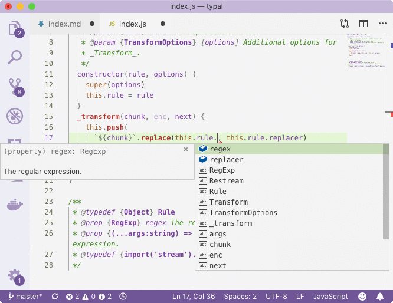
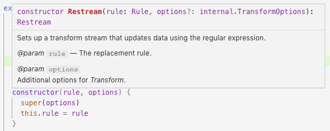
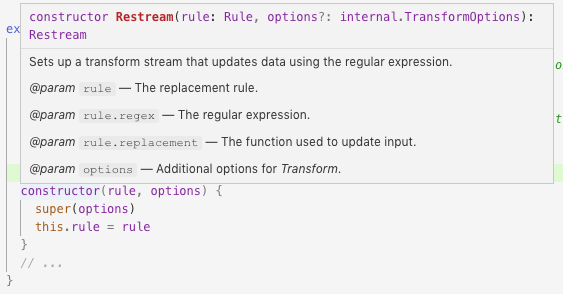

# Typal

[](https://npmjs.org/package/typal)

`typal` Keeps Types In XML files And Converts Them To (1) JavaScript JSDoc, (2) Closure Externs and (3) Markdown Documentation. It is the alternative to TypeScript definitions and utilises the power of JSDoc for excellent developer experience, documentation readability and compiler annotation. It also makes integration between _Google Closure Compiler_ and _VSCode_ easy, using the JSDoc notations that are understood by both at the same time.

The package's main use is as the CLI tool to generate typedefs, but it also has an API for parsing types and properties with regular expressions.

```sh
yarn add -DE typal
```

<p align="center"><a href="#table-of-contents"></a></p>

## Table Of Contents

- [Table Of Contents](#table-of-contents)
- [Purpose And Use-Cases](#purpose-and-use-cases)
  * [Naïve approach](#naïve-approach)
  * [JSDoc approach](#jsdoc-approach)
  * [Closure approach](#closure-approach)
    * [Shell Command To Spawn Closure](#shell-command-to-spawn-closure)
    * [Google Closure Compiler Warnings](#google-closure-compiler-warnings)
    * [Closure-Compatible JSDoc](#closure-compatible-jsdoc)
    * [Generated Externs](#generated-externs)
    * [Result Of Compilation](#result-of-compilation)
    * [Externs As Types](#externs-as-types)
    * [Annotating Types](#annotating-types)
- [CLI](#cli)
  * [*Standard*](#standard)
  * [*Closure*](#closure)
  * [*Externs*](#externs)
  * [_Typal_ Arguments](#typal-arguments)
  * [Migration](#migration)
- [Schema](#schema)
  * [Types](#types)
  * [Type](#type)
    * [Prototype Notation](#prototype-notation)
    * [Extends Notation](#extends-notation)
    * [Closure Override](#closure-override)
  * [Property](#property)
  * [Import](#import)
- [API](#api)
  * [class `Type`](#class-type)
  * [class `Property`](#class-property)
  * [`getNameWithDefault(name: string, defaultValue: ?(string|boolean|number), type: string=, parentParam: string=): string`](#getnamewithdefaultname-stringdefaultvalue-stringbooleannumbertype-stringparentparam-string-string)
  * [`parseFile(xml: string, rootNamespace: string=): { types, imports, namespace }`](#parsefilexml-stringrootnamespace-string--types-imports-namespace-)
    * [Root Namespace](#root-namespace)
- [Optional And Default](#optional-and-default)
- [Copyright](#copyright)

<p align="center"><a href="#table-of-contents"></a></p>

## Purpose And Use-Cases

The main purpose of this package is to generate _JSDoc_ annotations that are understood both by _VSCode_, and compatible with _Google Closure Compiler_ via its externs system. The project deliberately deviates from _TypeScript_ and is meant for _JavaScript_ development, and it proves that typing can be achieved perfectly well with _JSDoc_. It's idea is to store files in an XML file, and then embed them in JS and README files and externs.

The solutions provided by _Typal_ are:

1. Manage types from an external XML location.
1. Compile types for JSDoc compatible both with _GCC_ and _VSCode_.
1. Compile types as externs for _GCC_ and use in other packages.
1. Place types' descriptions as formatted tables in markdown (used in [_Documentary_](https://github.com/artdecocode/documentary)).
1. Improve the DevX by increasing the visibility of functions' APIs.

---


The example given below will illustrate why _Typal_ is extremely useful as the tool both for plain JSDoc management and JSDoc for _Google Closure Compiler_ workflow.

_**<a name="naïve-approach">Naïve approach</a>**: Let's implement a transform stream that updates data using regular expressions specified in the constructor:_

<table>
<tr/>
<tr><td>

```js
import { Transform } from 'stream'

export class Restream extends Transform {
  /**
   * Sets up a transform stream that updates data using the regular expression.
   * @param {Rule} rule The replacement rule.
   * @param {TransformOptions} [options] Additional options for _Transform_.
   */
  constructor(rule, options) {
    super(options)
    this.rule = rule
  }
  _transform(chunk, enc, next) {
    this.push(
      `${chunk}`.replace(this.rule.regex, this.rule.replacer)
    )
    next()
  }
}
```
<hr>

```js
/**
 * @typedef {Object} Rule The replacement rule.
 * @prop {RegExp} regex The regular expression.
 * @prop {(...args:string) => string} replacer The function used to update input.
 * @typedef {import('stream').TransformOptions} TransformOptions
 */
```
</td></tr>
</table>

In the file, we have defined a type using typedef, and imported a type from the internal Node.JS API. All is well, and we get our _JSDoc_ autosuggestions that help us understand that what we're doing is correct.

<p align="center">
  
</p>

However, there are 2 problems with that:

1. _Google Closure Compiler_ does not understand typedefs a) without `var`iable declaration underneath, b) with `@prop`erties and c) with functions in `(...args: string) => string` notation. The format for _GCC_ typedef for our example would be the one below. And if we tried to use it, VSCode would not understand it, and we would loose the description of individual properties of the type.
    ```js
    /**
     * @typedef {{ regex: RegExp, replacement: function(...string): string }}
     */
    var Rule
    ```
1. _Google Closure Compiler_ does not understand `@typedef {import('from').Name}` syntax. It is currently not supported, and to be able to reference types from other packages, they must have externs. So for the _TransformOptions_, we need `stream.TransformOptions` externs. To reference types from the same package but across files, _GCC_ will need types to be imported as ES6 imports (like how things were in 2018), e.g.,
    ```js
    import Rule from './src' // pre-typedef import
    /**
     * @param {Rule} rule
     */
    const fn = (rule) => {}
    ```
1. The documentation that we wrote as _JSDoc_ type declarations has to be copied and pasted into the `README.md` file manually, and all tables need to be also constructed.
1. It is not clear what interface the _Rule_ type adheres to, because _VSCode_ does not show that information:
    <p align="center">
      
    </p>

<p align="center"><a href="#table-of-contents"></a></p>

_**<a name="jsdoc-approach">JSDoc approach</a>**: Now let's refactor the code that we have, and place the types definitions in the `types.xml` file instead of the source code:_

```xml
<types>
  <import from="stream" name="TransformOptions"
    link="https://nodejs.org/api/stream.html#stream_class_stream_transform" />
  <type name="Rule" desc="The replacement rule." noToc>
    <prop type="RegExp" name="regex">
      The regular expression.
    </prop>
    <prop type="(...args:string) => string" name="replacement">
      The function used to update input.
    </prop>
  </type>
</types>
```

The types files support `<import>`, `<type>` and `<prop>` tags. We then update the source code to indicate the location of where types should be read from (there needs to be a newline before the end of the file):

```js
import { Transform } from 'stream'

export class Restream extends Transform {
  /**
   * Sets up a transform stream that updates data using the regular expression.
   * @param {Rule} rule The replacement rule.
   * @param {TransformOptions} [options] Additional options for _Transform_.
   */
  constructor(rule, options) {
    super(options)
    this.rule = rule
  }
  // ...
}

/* typal example/restream/types.xml */
```

Then, we call the `typal` binary to get it to update the source: `typal example/restream/index.js`:

```js
import { Transform } from 'stream'

export class Restream extends Transform {
  /**
   * Sets up a transform stream that updates data using the regular expression.
   * @param {Rule} rule The replacement rule.
   * @param {RegExp} rule.regex The regular expression.
   * @param {(...args:string) => string} rule.replacement The function used to update input.
   * @param {TransformOptions} [options] Additional options for _Transform_.
   */
  constructor(rule, options) {
    super(options)
    this.rule = rule
  }
  // ...
}

/* typal example/restream/types.xml */
/**
 * @typedef {import('stream').TransformOptions} TransformOptions
 * @typedef {Object} Rule The replacement rule.
 * @prop {RegExp} regex The regular expression.
 * @prop {(...args:string) => string} replacement The function used to update input.
 */
```

From that point onward, the JSDoc documentation is managed from the separate file. It can also be embedded into the Markdown, using the _Documentary_ documentation pre-processor by adding the `%TYPEDEF: example/restream/types.xml%` marker in the README file:

[`import('stream').TransformOptions`](https://nodejs.org/api/stream.html#stream_class_stream_transform) __<a name="type-streamtransformoptions">`stream.TransformOptions`</a>__

__<a name="type-rule">`Rule`</a>__: The replacement rule.

|       Name       |                  Type                  |            Description             |
| ---------------- | -------------------------------------- | ---------------------------------- |
| __regex*__       | <em>RegExp</em>                        | The regular expression.            |
| __replacement*__ | <em>(...args:string) =&gt; string</em> | The function used to update input. |

The link to the _Rule_ type was also added to the Table of Contents, however it can be skipped if the `type` element had the `noToc` property set on it. We also added the `link` property to the `import` element to place a link to Node.JS API docs in documentation.

Another advantage, is that the `Rule` type was expanded into individual properties in JSDoc above the constructor method. It allows to preview all properties and their descriptions when hovering over functions:

<p align="center">
  
</p>

<p align="center"><a href="#table-of-contents"></a></p>

_**<a name="closure-approach">Closure approach</a>**: Finally, if we want to allow our package to be compiled as part of other packages with GCC (or compile a binary from the lib we've written), we need to make sure the JSDoc is in the format that it accepts._

<table>
<tr>
  <th>We create a simple program that uses our Restream library:</th>
  <th>And run it with Node.JS:</th>
</tr>
<tr>
  <td>

```js
import { Restream } from 'restream'

const restream = new Restream({
  regex: /__(.+?)__/,
  replacement(match, s) {
    return `<em>${s}</em>`
  },
})

restream.pipe(process.stdout)
restream.end('__hello world__')
```
  </td>
  <td>

```html
<em>hello world</em>
```
  </td>
</tr>
</table>

Let's try to compile a program using _GCC_ now (using [_Depack_](https://github.com/dpck/depack)) and see what happens:

<table>
<tr><th colspan="2"><a name="shell-command-to-spawn-closure">Shell Command To Spawn Closure</a></th></tr>
<tr><td colspan="2">

```js
java -jar google-closure-compiler-java/compiler.jar --compilation_level ADVANCED \
--language_out ECMASCRIPT_2017 --formatting PRETTY_PRINT \
--externs @depack/externs/v8/stream.js --externs @depack/externs/v8/events.js \
--externs @depack/externs/v8/global.js --externs @depack/externs/v8/nodejs.js \
--module_resolution NODE --output_wrapper "#!/usr/bin/env node
'use strict';
const stream = require('stream');%output%" \
--js node_modules/stream/package.json \
     node_modules/stream/index.js \
     example/restream/program.js \
     example/restream/compat.js
```
</td></tr>
<tr>
  <td rowspan="2">

The command above was generated with _Depack_ call on the right, where:
- `-c` means Node.JS compilation (adds the wrapper, mocks and externs),
- `-a` means ADVANCED mode,
- and `-p` means pretty-printing.
  </td>
</tr>
<tr>
  <td>
<em>

```sh
depack example/restream/program -c -a -p
```
</em>
  </td>
</tr>
</table>

> _Google Closure Compiler_ does not discover source code files the list of which must be passed manually. In addition, it does not work with internal Node.JS modules natively. The software that performs static analysis of programs to detect what files to feed to the compiler, as well as mocking Node.JS built-in modules in the `node_modules` folder and providing externs for them is called _Depack_.

After finishing its job, the compiler will give us warnings shown below, which tell us that the program was not type-checked correctly. Sometimes we can ignore warnings, but we loose the ability to ensure correct typing. It is also possible that the compiler will perform the advanced optimisations incorrectly by mangling property names (e.g., `regex` becomes `a`), but it is not the case here because all files are used together, but if we were publishing the library, the first parameter `rule` would not adhere to the _Rule_ interface.

<table>
<tr><th><a name="google-closure-compiler-warnings">Google Closure Compiler Warnings</a></th></tr>
<tr><td>

```js
restream/index2.js:6: WARNING - Bad type annotation. Unknown type Rule
   * @param {Rule} rule The replacement rule.
             ^

restream/index2.js:8: WARNING - Bad type annotation. type not recognized due to syntax error.
See https://github.com/google/closure-compiler/wiki/Annotating-JavaScript-for-the-Closure-Compiler
for more information.
   * @param {(...args:string) => string} rule.replacement The function used to update input.
              ^

restream/index2.js:9: WARNING - Bad type annotation. Unknown type TransformOptions
   * @param {TransformOptions} [options] Additional options for _Transform_.
             ^

restream/index2.js:25: WARNING - Bad type annotation. expected closing }
See https://github.com/google/closure-compiler/wiki/Annotating-JavaScript-for-the-Closure-Compiler
for more information.
 * @typedef {import('stream').TransformOptions} TransformOptions
                   ^

restream/index2.js:26: WARNING - Bad type annotation. type annotation incompatible with
other annotations.
See https://github.com/google/closure-compiler/wiki/Annotating-JavaScript-for-the-Closure-Compiler
for more information.
 * @typedef {Object} Rule The replacement rule.
   ^
```
</td></tr>
<tr><td>

The warnings produced by the compiler tell us the points discussed in the beginning:
- the classic typedefs `{Object} Rule`,
- function types `(...args:string) => string`,
- and imports `import('stream').TransformOptions` are not understood.
</td></tr>
</table>

This is because the traditional JSDoc annotation is not compatible with the compiler. To solve that, we need to compile JSDoc in _Closure_ mode with _Typal_. First, we want to adjust our types to include more features:

<table>
<tr><th>Updated Types For Closure (<a href="example/restream/types2.xml">view source</a>)</th></tr>
<tr><td>

```xml
<types namespace="_restream">
  <import from="stream" name="TransformOptions"
    link="https://nodejs.org/api/stream.html#stream_class_stream_transform" />
  <type name="Rule" desc="The replacement rule.">
    <prop type="!RegExp" name="regex">
      The regular expression.
    </prop>
    <prop type="(...args:string) => string"
      closure="function(...string): string" name="replacement">
      The function used to update input.
    </prop>
  </type>
  <type type="!Array<!_restream.Rule>" name="Rules"
    desc="Multiple replacement rules.">
  </type>
</types>
```
</td></tr>
<tr><td>

1. Annotate the nullability of our types using **!**, since there's attention to *`null`* in _GCC_, not like traditional JS.
1. We also add the `closure` property to the `prop` elements to make them use that type instead of the traditional one. Unfortunately, there's no way to use both in code for _VSCode_ and for _GCC_, however we can still use more readable `type` descriptions when generating README documentation.
1. Add the namespace, because we're going to generate externs and if there are other programs that define the _Rule_ extern, there would be a conflict between the two. Adding namespace ensures that the chances of that happening are minimal. In addition, we prefix the namespace with `_` because we'll put it in externs, and if we or people using our library called a variable `restream`, the compiler will think that its related to the extern which it is not because it's a namespace in externs, but an instance of _Restream_ in source code.
1. Finally, add another type _Rules_ just to illustrate how to reference types across and within namespaces. Although defined in the same namespace, the properties need to give full reference to the type.
</td></tr>

</table>

If we now compile the source code using the `--closure` flag (so that the command is `typal example/restream/closure.js -c`), our source code will have JSDoc that is fully compatible with the _Google Closure Compiler_:

<table>
<tr><th>
The Source Code With <a name="closure-compatible-jsdoc">Closure-Compatible JSDoc</a> (<a href="example/restream/compat.js">view source</a>)
</th></tr>
<tr>
  <td>

```js
import { Transform } from 'stream'

export class Restream extends Transform {
  /**
   * Sets up a transform stream that updates data using the regular expression.
   * @param {!_restream.Rule} rule The replacement rule.
   * @param {!RegExp} rule.regex The regular expression.
   * @param {(...args:string) => string} rule.replacement The function used to update input.
   * @param {!stream.TransformOptions} [options] Additional options for _Transform_.
   */
  constructor(rule, options) {
    super(options)
    this.rule = rule
  }
  _transform(chunk, enc, next) {
    this.push(
      `${chunk}`.replace(this.rule.regex, this.rule.replacement)
    )
    next()
  }
}
```
  </td>
</tr>
<tr>
  <td>

  There have to be some manual modifications to the source:

  - We rename the `@params` to use the namespace and make it non-nullable since it's a thing in _Closure_, i.e., if we don't do it the type of the param will actually be `(restream.Rule|null)`: `@param {_!restream.Rule} rule`;
  - We also add the namespace to the internal module `@param {!stream.TransformOptions}`, because in _Closure_ the externs are provided for the `stream` namespace.
  <hr/>

  The following changes are introduced automatically by _Typal_ after we started using the `--closure` mode:
  </td>
</tr>
<tr><td>

```js
/* typal example/restream/types2.xml */
/**
  * @suppress {nonStandardJsDocs}
  * @typedef {_restream.Rule} Rule The replacement rule.
  */
/**
  * @suppress {nonStandardJsDocs}
  * @typedef {Object} _restream.Rule The replacement rule.
  * @prop {!RegExp} regex The regular expression.
  * @prop {function(...string): string} replacement The function used to update input.
  */
```
</td></tr>
<tr><td>
The <em>Rule</em> type is now defined using 2 <code>@typedefs</code>, which are also suppressed to prevent warnings. The reason for the first item is so that the type can be imported in other files from our package, using <code>{import('restream').Rule}</code>. This is so because <code>{import('restream')._restream.Rule}</code> does not work in <em>VSCode</em>. The second type stays as is, and is printed with the namespace. It is still not picked up by <em>GCC</em>, but the warning is suppressed. Instead, when we come to generate externs in a minute, their name will match <code>_restream.Rule</code>, and the param for the function will be recognised by the compiler.
</td></tr>
<tr><td>

```js
/**
 * @suppress {nonStandardJsDocs}
 * @typedef {import('stream').TransformOptions} stream.TransformOptions
 */
```
</td></tr>
<tr><td>
The imports are now also suppressed (but the change will hopefully come into effect in the next version of the compiler), and printed with the namespace, so that we can refer to them in params and get both the autosuggestions, and <em>Closure</em> compatibility.
</td></tr>
<tr><td>

```js
/**
 * @suppress {nonStandardJsDocs}
 * @typedef {_restream.Rules} Rules Multiple replacement rules.
 */
/**
 * @suppress {nonStandardJsDocs}
 * @typedef {!Array<!_restream.Rule>} _restream.Rules Multiple replacement rules.
 */
```
</td></tr>
<tr><td>
Any types within the namespace must refer to each other using their full name.
</td></tr>
</table>

Before we continue to compilation, we still need to generate externs, because the _Closure_ compiler does not know about the _Rule_ type. Externs is the way of introducing types to the compiler, so that it can do type checking and property renaming more accurately. Once again, we place the `/* typal example/restream/types2.xml */` marker in the empty `externs.js` file, and let _Typal_ to the job with `typal example/restream/externs.js --externs` command (or `-e`).

<table>
<tr><th><a name="generated-externs">Generated Externs</a> For Restream (<a href="example/restream/externs.js">view source</a>)</th></tr>
<tr><td>

```js
/* typal example/restream/types2.xml */
/** @const */
var _restream = {}
/**
 * @typedef {{ regex: !RegExp, replacement: function(...string): string }}
 */
_restream.Rule
/**
 * @typedef {!Array<!_restream.Rule>}
 */
_restream.Rules
```
</td></tr>
<tr><td>
The externs are generated with the Closure-compatible syntax and ready to be used for compilation of our example program.
</td></tr>
</table>

To continue, we run `depack example/restream/program -c -a -p --externs restream/externs.js` again, and this time, _Depack_ will pass the externs argument to the compiler as we request.

<table>
<tr><th><a name="result-of-compilation">Result Of Compilation</a></th></tr>
<tr><td>

```js
#!/usr/bin/env node
'use strict';
const stream = require('stream');             
const {Transform:c} = stream;
class d extends c {
  constructor(a, b) {
    super(b);
    this.a = a;
  }
  _transform(a, b, f) {
    this.push(`${a}`.replace(this.a.regex, this.a.replacement));
    f();
  }
}
;const e = new d({regex:/__(.+?)__/, replacement(a, b) {
  return `<em>${b}</em>`;
}});
e.pipe(process.stdout);
e.end("__hello world__");
```
</td></tr>
<tr><td><em>stdout</em></td></tr>
<tr><td>

```js
java -jar /Volumes/backup/closure-compiler/target/closure-compiler-1.0-SNAPSHOT.jar \
--compilation_level ADVANCED --language_out ECMASCRIPT_2017 --formatting PRETTY_PRINT \
--externs example/restream/externs.js --package_json_entry_names module,main \
--entry_point example/restream/program.js --externs \
../../depack/src/node_modules/@depack/externs/v8/stream.js --externs \
../../depack/src/node_modules/@depack/externs/v8/events.js --externs \
../../depack/src/node_modules/@depack/externs/v8/global.js --externs \
../../depack/src/node_modules/@depack/externs/v8/global/buffer.js --externs \
../../depack/src/node_modules/@depack/externs/v8/nodejs.js
Modules: example/restream/compat.js
Built-ins: stream
Running Google Closure Compiler target            
```
</td></tr>
<tr><td><em>stderr</em></td></tr>
</table>

Although we've generated the externs and passed them to the compiler, we don't actually need them here when generating a single executable file. Notice how the compiler didn't rename the `regex` and `replacement` properties of the rule variable, but the variable itself is stored inside of the class as `a`. This is precisely the point of externs &mdash; to prevent the compiler from mangling properties that can come from outside code. Now, if we were compiling a library for use by other developers, and publishing it, we would want to prevent mangling optimisation, and then we would use externs. However, this optimisation only happens in the _ADVANCED_ mode, where all comments with JSDoc is stripped, making the library hard-to use by others. But when we create a program and not a library, we can avoid using the externs, and pass the types just as a source file using the `--js` flag. This will still result in type-checking but also produce the optimisation of variable names (though in case of _Node.JS_ programs the gain is minimal because the difference in size is not that significant, but for the web it might be helpful).

<table>
<tr><th><a name="externs-as-types">Externs As Types</a></th></tr>
<tr><td>

```js
#!/usr/bin/env node
'use strict';
const stream = require('stream');             
const {Transform:c} = stream;
class d extends c {
  constructor(a, b) {
    super(b);
    this.a = a;
  }
  _transform(a, b, f) {
    this.push(`${a}`.replace(this.a.b, this.a.c));
    f();
  }
}
;const e = new d({b:/__(.+?)__/, c(a, b) {
  return `<em>${b}</em>`;
}});
e.pipe(process.stdout);
e.end("__hello world__");
```
</td></tr>
<tr><td>
The new command is <code>depack example/restream/program -c -a -p --js example/restream/externs.js</code> and it produces correctly optimised code.
</td></td>
</table>

And so that's it! We've successfully compiled our Node.JS program with _Google Closure Compiler_ using _Depack_ as the CLI interface, and _Typal_ as the utility to organise types, both for README documentation, JSDoc annotation and Compiler externs information. There is just one last thing to add.

<table>
<tr><th><a name="annotating-types">Annotating Types</a></th></tr>
<tr><td>

```js
import { Restream } from 'restream'

/**
 * The rule to enable `<em>` tag conversion from Markdown.
 * @type {_restream.Rule}
 */
const rule = {
  regex: /__(.+?)__/,
  replacement(match, s) {
    return `<em>${s}</em>`
  },
}
const restream = new Restream(rule)

restream.pipe(process.stdout)
restream.end('__hello world__')

/**
 * @suppress {nonStandardJsDocs}
 * @typedef {import('restream').Rule} _restream.Rule
 */
```
</td></tr>
</table>

When writing code that imports types from libraries, we can use the `{import('lib').Type}` notation for _VSCode_ to give us auto-completions, but we need to suppress it. However, because now we're naming imported types with the namespace, _Closure_ will pick them up from externs if it finds it. Packages can publish their externs and point to them using the `externs` field in their **package.json** file, which will be read by _Depack_ and passed to _GCC_ in the `--externs` flag.

<p align="center"><a href="#table-of-contents"></a></p>

## CLI

_Typal_ is the command-line utility that is used to manage _JSDoc_ types in JavaScript source files. The typedefs are now sourced from the `types.xml` file and embedded on demand. There are 3 modes to embedding types:

1. <a name="standard">*Standard*</a>, no flags required: places only _VSCode_ compatible code. Can be used when no Closure-compilation will be performed on packages. Does not utilise namespaces. Expands the parameters of complex types for better visibility.
    <details>
    <summary>Show Standard JSDoc</summary>
    <table><tr/><tr><td>

    ```js
    /**
     * @param {Conf} conf The configuration object.
     * @param {string} conf.source The source of where to read the data.
     * @param {boolean} [conf.closeOnFinish=true] Closes the stream when done. Default `true`.
     * @param {TransformOptions} options
     */
    const prog = (conf, options) => {}
    
    /* typal example/cli/types.xml */
    /**
     * @typedef {import('stream').TransformOptions} TransformOptions
     * @typedef {Object} Conf The configuration object.
     * @prop {string} source The source of where to read the data.
     * @prop {boolean} [closeOnFinish=true] Closes the stream when done. Default `true`.
     */
    ```
    </tr></td></table>
    </details>
1. <a name="closure">*Closure*</a> with `-c` flag: suppresses standard typedefs' annotations so that Closure Compiler does not show warnings. Introduces namespaces for internal as well as external APIs to make types' sources more visible.
    <details>
    <summary>Show Closure JSDoc</summary>
    <table><tr/><tr><td>

    ```js
    /**
     * @param {_typal.Conf} conf The configuration object.
     * @param {string} conf.source The source of where to read the data.
     * @param {boolean} [conf.closeOnFinish=true] Closes the stream when done. Default `true`.
     * @param {stream.TransformOptions} options
     */
    const prog = (conf, options) => {}
    
    /* typal example/cli/types.xml */
    /**
     * @suppress {nonStandardJsDocs}
     * @typedef {_typal.Conf} Conf The configuration object.
     */
    /**
     * @suppress {nonStandardJsDocs}
     * @typedef {Object} _typal.Conf The configuration object.
     * @prop {string} source The source of where to read the data.
     * @prop {boolean} [closeOnFinish=true] Closes the stream when done. Default `true`.
     */
    /**
     * @suppress {nonStandardJsDocs}
     * @typedef {import('stream').TransformOptions} stream.TransformOptions
     */
    ```
    </tr></td></table>
    </details>
1. <a name="externs">*Externs*</a> with `-e` flag: generates types only understood by the _Google Closure Compiler_, primarily in the `externs.js` file. These types do not have any meaning for the coding process and are only used in compilation either as types for programs, or externs for libraries.
    <details>
    <summary>Show Externs JSDoc</summary>
    <table><tr/><tr><td>

    ```js
    /* typal example/cli/types.xml */
    /** @const */
    var _typal = {}
    /**
     * The configuration object.
     * @typedef {{ source: string, closeOnFinish: (boolean|undefined) }}
     */
    _typal.Conf
    ```
    </tr></td></table>
    </details>

<p align="center"><a href="#table-of-contents"></a></p>

### _Typal_ Arguments

```sh
$ typal source [--closure|externs] [-o output] [-vh]
```

The following arguments are supported by this software.

<table>
  <tr><th>Argument</th><th>Short</th><th>Description</th></tr>
  <tr><td>source</td><td></td><td>
    The path to the source file or directory with files to embed types into.
  </td>
  </tr>
  <tr>
    <td>--output</td>
    <td>-o</td>
    <td>
      The destination where to save output.
          If not passed, the file will be overwritten.
          If <code>-</code> is passed, prints to stdout.
    </td>
  </tr>
  <tr><td>--closure</td><td>-c</td><td>
    Whether to generate types in <em>Closure</em> mode.
  </td>
  </tr>
  <tr><td>--externs</td><td>-e</td><td>
    Whether to generate externs for <em>GCC</em>.
  </td>
  </tr>
  <tr>
    <td>--migrate</td>
    <td>-m</td>
    <td>
      Extracts types from JavaScript source code and saves them
          into the types.xml file specified in the output option.
    </td>
  </tr>
  <tr><td>--help</td><td>-h</td><td>Print the help information and exit.</td></tr>
  <tr><td>--version</td><td>-v</td><td>Show the version's number and exit.</td></tr>
</table>

<p align="center"><a href="#table-of-contents"></a></p>

### Migration

When there are JSDoc types written in JavaScript files, and they need to be put in the `types.xml` file, it can be done automatically with the `--migrate` command. In this case, _Typal_ will scan the source code for the type definitions and their properties, defined as `@prop` or `@property` tags, and place them either in the output file when specified, or print to the stdout. This will help to move all types into XML declarations, which can then be manually adjusted if necessary, and embedded into the source code using the `/* typal types.xml */` marker, and in README documentation using [_Documentary_](https://artdecocode.com/documentary/).

<table>
<tr><th>Using Migrate Command</th></tr>
<tr><td>

```js
/**
 * @typedef {import('koa-multer').StorageEngine} StorageEngine
 * @typedef {import('http').IncomingMessage} IncomingMessage
 * @typedef {import('koa-multer').File} File
 */

/**
 * @typedef {Object} Example An example type.
 * @typedef {Object} SessionConfig Description of Session Config.
 * @prop {string} key The cookie key.
 * @prop {number|'session'} [maxAge=86400000] maxAge in ms. Default is 1 day.
 * @prop {boolean} [overwrite] Can overwrite or not. Default `true`.
 * @prop {boolean} [httpOnly] httpOnly or not or not. Default `true`.
 * @prop {boolean} [signed=false] Signed or not. Default `false`.
 * @prop {boolean} [rolling] Force a session identifier cookie to be set.
 * @prop {boolean} [renew] Renew session when session is nearly expired.
 */
```
</td></tr>
<tr><td>
For example, the types above can be extracted into the types file using the <code>typal src/index.js -m [-o types/index.xml]</code> command.
</td></tr>
<tr><td>

```xml
<types>
  <import name="StorageEngine" from="koa-multer" />
  <import name="IncomingMessage" from="http" />
  <import name="File" from="koa-multer" />
  <type name="Example" desc="An example type." />
  <type name="SessionConfig" desc="Description of Session Config.">
    <prop string name="key">
      The cookie key.
    </prop>
    <prop type="number|'session'" name="maxAge" default="86400000">
      maxAge in ms. Default is 1 day.
    </prop>
    <prop boolean name="overwrite" default="true">
      Can overwrite or not.
    </prop>
    <prop boolean name="httpOnly" default="true">
      httpOnly or not or not.
    </prop>
    <prop boolean name="signed" default="false">
      Signed or not.
    </prop>
    <prop opt boolean name="rolling">
      Force a session identifier cookie to be set.
    </prop>
    <prop opt boolean name="renew">
      Renew session when session is nearly expired.
    </prop>
  </type>
</types>
```
</td></tr>
</table>

<p align="center"><a href="#table-of-contents"></a></p>

## Schema

The types can be defined according to the following schema. It consists of the `types`, `type` and `property` elements.

### Types

```xml
<types
  namespace="_namespace">
  <import .../>
  <type ...>...</type>
</types>

```

The single root element for the XML file.

- `namespace` [_optional_]: how all types will be prefixed in the source code and externs. The use of namespaces is generally only needed for when using _GCC_ to prevent clashes of types, e.g., it is common to name the config objects _"Config"_. The namespace will typically start with `_` to also prevent variable name clashes with extern namespaces.
    ```js
    // SOURCE.js
    // The first line is to enable exporting via VSCode's typedef import.
    /**
     * @typedef {_restream.Rule} Rule The replacement rule.
     */
    // The second line is to use within the source file, so that the externs
    // match the annotated type.
    /**
     * @typedef {Object} _namespace.Rule The replacement rule.
     */

    /**
     * @param {_namespace.Rule} rule
     */
    function hello(rule) {}

    // EXTERNS.js
    /** @const */
    var _namespace = {}
    /** @typedef { myType: boolean } */
    _namespace.Type
    ```

<p align="center"><a href="#table-of-contents"></a></p>

### Type

The type represents a _JSDoc_ type.

```xml
<type
  name="Type"
  desc="The description of the type."
  type="(name: string) => number"
  constructor interface record
  extends="_namespace.ParentType"
  closure="function(string): number">
    <prop name="...">...</prop>
</type>
```

- `name`: [_required_]: the name of the type.
- `desc` [_optional_]: the optional description.
- `type` [_optional_]: what is the type, default `Object`.
- `constructor` [_optional_]: for externs, adds the `@constructor` annotation and declares the properties via the _prototype_.
    <details>
    <summary><strong>Show <a name="prototype-notation">Prototype Notation</a></strong></summary>

    ```js
    /* typal example/schema/constructor.xml */
    /** @const */
    var _test = {}
    /**
     * The example type.
     * @extends {_ns.ParentType}
     * @constructor
     */
    _test.Test
    /**
     * A prop.
     * @type {(boolean|undefined)}
     */
    _test.Test.prototype.bool
    ```
    </details>
- `interface` [_optional_]: for externs, same as `@constructor`, but adds the `@interface` annotation.
- `record` [_optional_]: for externs, same as `@constructor`, but adds the `@record` annotation.
- `extends` [_optional_]: for `constructors`, `interfaces` and `records` this allows to inherit properties from the parent types (see above).
    <details>
    <summary><strong>Show <a name="extends-notation">Extends Notation</a></strong></summary>
    <table>
    <tr><th>Extends Type (<a href="example/schema/extends.xml">view extends.xml</a>)</th></tr>
    <tr><td>

    ```js
    /* typal example/schema/extends.xml */
    /**
     * @suppress {nonStandardJsDocs}
     * @typedef {_test.Test} Test The example type.
     */
    /**
     * @suppress {nonStandardJsDocs}
     * @typedef {_ns.ParentType & _test.$Test} _test.Test The example type.
     */
    /**
     * @suppress {nonStandardJsDocs}
     * @typedef {Object} _test.$Test The example type.
     * @prop {boolean} [bool] A prop.
     */
    ```
    </td></tr>
    <tr><td><em>JSDoc</em> typedefs will contain an extra class denoted with <code>$</code> to be able to extend the parent class, because there's no other way to do it: if the typedef had the parent in its type notation (instead of <code>{Object}</code>), then the properties wouldn't be applied.</tr></td>
    <tr><td>

    ```js
    /* typal example/schema/extends.xml */
    /** @const */
    var _test = {}
    /**
     * The example type.
     * @extends {_ns.ParentType}
     * @record
     */
    _test.Test
    /**
     * A prop.
     * @type {(boolean|undefined)}
     */
    _test.Test.prototype.bool
    ```
    </td></tr>
    <tr><td><em>Externs</em> just add the <code>@extends</code> marker when the type is either <code>@constructor</code>, <code>@interface</code> or <code>@record</code>.</tr></td>
    </table>
    </details>
- `closure` [_optional_]: an override of the type when generating doc in closure mode.
    <details>
    <summary><strong>Show <a name="closure-override">Closure Override</a></strong></summary>

    <table>
    <tr><th>Closure Override (<a href="example/schema/closure.xml">view closure.xml</a>)</th></tr>
    <tr><td>

    ```js
    /* typal example/schema/closure.xml */
    /**
     * @suppress {nonStandardJsDocs}
     * @typedef {_test.Example} Example
     */
    /**
     * @suppress {nonStandardJsDocs}
     * @typedef {function(string): number} _test.Example
     */
    ```
    </td></tr>
    <tr><td>In <em>Closure</em> mode, <em>Typal</em> will print the value of the <code>closure</code> property. This is helpful for displaying user-readable documentation in README files, but using the types for compilation. There's no way to use both in source code (i.e., the standard type for <em>VSCode</em> and the closure type for <em>GCC</em>).</tr></td>
    <tr><td>

    ```js
    /* typal example/schema/closure.xml */
    /**
     * @typedef {(string) => number} Example
     */
    ```
    </td></tr>
    <tr><td>In standard mode, only the <code>type</code> attribute is displayed. This is not compatible with <em>GCC</em>, therefore should only be used for [<em>JSDoc</em> approach](#jsdoc-approach) programming.</tr></td>
    </table>
    </details>

<p align="center"><a href="#table-of-contents"></a></p>

### Property

The properties are found inside of the `Type` elements. At the moment, the *must* have a description, otherwise the parsing won't work.

```xml
<prop
  name="property"
  string? boolean? number? type?="Type"
  opt? default?="The default value"
  closure?="_ns.Type">
Property Description.
</prop>
```

- `name`: the name of the property.
- `string` [_optional_]: sets the type to be `string`.
- `boolean` [_optional_]: sets the type to be `boolean`.
- `number` [_optional_]: sets the type to be `number`.
- `type` [_optional_]: sets the type of the property. Default `*`.
- `opt` [_optional_]: whether the property is optional. In externs this will result in `{ prop: (string|undefined) }`.
- `default` [_optional_]: the default value of the property. Used to add the `Default: value.` to the property description, and `@param {type} [prop=default]` when annotating JS functions.
- `closure` [_optional_]: an override of the type when generating doc in closure mode.

<p align="center"><a href="#table-of-contents"></a></p>

### Import

```xml
<type
  name="Type"
  desc="The description of the type."
  type="(name: string) => number"
  constructor interface record
  extends="_namespace.ParentType"
  closure="function(string): number">
    <prop name="...">...</prop>
</type>
```

- `name`: the name of the imported type.
- `from`: the package (`restream`) or path (`restream/src/Rule`) to import from.
- `ns` [_optional_]: if different from the path, the namespace with which the type will be imported.
- `link` [_optional_]: the link to display in documentation with _Documentary_.
- `desc` [_optional_]: the description to print in documentation.

<table>
<tr><th>
  Imports (<a href="example/schema/import.xml">view import.xml</a>)
</th></tr>
<tr><td>

```js
/* typal example/schema/import.xml */
/**
 * @typedef {import('restream').Rule} Rule
 * @typedef {import('restream/src/markers').Marker} Marker
 * @typedef {import('fs').Readable} Readable
 */
```
</td></tr>
</table>

<p align="center"><a href="#table-of-contents"></a></p>

## API

The package is available by importing its named functions and classes:

```js
import { Type, Property, getNameWithDefault, parseFile } from 'typal'
```

Its primary use is in _Documentary_, and the API is therefore semi-private.

<p align="center"><a href="#table-of-contents"></a></p>

### class `Type`

This class represents the type.

<p align="center"><a href="#table-of-contents"></a></p>

### class `Property`

This class represents the properties of the type.

<p align="center"><a href="#table-of-contents"></a></p>

### `getNameWithDefault(`<br/>&nbsp;&nbsp;`name: string,`<br/>&nbsp;&nbsp;`defaultValue: ?(string|boolean|number),`<br/>&nbsp;&nbsp;`type: string=,`<br/>&nbsp;&nbsp;`parentParam: string=,`<br/>`): string`

Returns the name of a property with its default value, and surrounded by square brackets if default is given. If type is boolean or number, the default value is not surrounded by "". The default values are only used for _VSCode_ because _GCC_ does not use this information.

```js
/**
 * @param {*} requiredParam
 * @param {*} [optionalDefaultParam=false]
 * @param {*} [optionalDefaultParamString="test"]
 * @param {*} [optionalParam]
 *
 * @param {*} parentParam.requiredParam
 * @param {*} [parentParam.optionalDefaultParam=false]
 * @param {*} [parentParam.optionalDefaultParamString="test"]
 * @param {*} [parentParam.optionalParam]
 */
```

```js
import { getNameWithDefault } from 'typal'

console.log(getNameWithDefault('arg', 'test', 'string'))
console.log(getNameWithDefault('hello', true, 'boolean', 'arg'))
console.log(getNameWithDefault('world', 27, 'number', 'arg'))
```
```js
arg="test"
arg.hello=true
arg.world=27
```

<p align="center"><a href="#table-of-contents"></a></p>

### `parseFile(`<br/>&nbsp;&nbsp;`xml: string,`<br/>&nbsp;&nbsp;`rootNamespace: string=,`<br/>`): { types, imports, namespace }`

Returns the string parsed into _Types_ and _Properties_.

_Given the following types file:_

```xml
<types>
  <import name="ServerResponse" from="http" />
  <type name="SetHeaders"
    type="(s: ServerResponse) => void"
    closure="function(http.ServerResponse)"
    desc="Function to set custom headers on response." />
  <type name="StaticConfig" desc="Options to setup `koa-static`.">
    <prop string name="root">
      Root directory string.
    </prop>
    <prop number name="maxage" default="0">
      Browser cache max-age in milliseconds.
    </prop>
    <prop boolean name="hidden" default="false">
      Allow transfer of hidden files.
    </prop>
  </type>
</types>
```

_It can be parsed using the following call:_

```js
import read from '@wrote/read'
import { parseFile } from 'typal'

const getFile = async () => {
  const file = await read('test/fixture/types.xml')
  const res = parseFile(file)
  return res
}
```

_The result will contain Types and Imports:_

```js
{ namespace: undefined,
  types: 
   [ Type {
       name: 'SetHeaders',
       type: '(s: ServerResponse) => void',
       closureType: 'function(http.ServerResponse)',
       description: 'Function to set custom headers on response.',
       noToc: false,
       spread: false,
       import: false,
       noExpand: false,
       link: null,
       properties: [],
       namespace: null,
       isConstructor: false,
       isInterface: false,
       isRecord: false,
       extends: null },
     Type {
       name: 'StaticConfig',
       type: null,
       closureType: null,
       description: 'Options to setup `koa-static`.',
       noToc: false,
       spread: false,
       import: false,
       noExpand: false,
       link: null,
       properties: 
        [ Property {
            name: 'root',
            description: 'Root directory string.',
            type: 'string',
            closureType: 'string',
            hasDefault: false,
            default: null,
            optional: false },
          Property {
            name: 'maxage',
            description: 'Browser cache max-age in milliseconds.',
            type: 'number',
            closureType: 'number',
            hasDefault: true,
            default: 0,
            optional: true },
          Property {
            name: 'hidden',
            description: 'Allow transfer of hidden files.',
            type: 'boolean',
            closureType: 'boolean',
            hasDefault: true,
            default: false,
            optional: true } ],
       namespace: null,
       isConstructor: false,
       isInterface: false,
       isRecord: false,
       extends: null } ],
  imports: 
   [ Import {
       ns: 'http',
       name: 'ServerResponse',
       from: 'http',
       desc: undefined,
       link: undefined } ] }
```

#### Root Namespace

Passing the `rootNamespace` allows to ignore the given namespace in types and properties. This can be used for compiling documentation when only single namespace is used, and readers can assume where the types come from. However, this should only be used when printing to docs, but when compiling JSDoc, the full namespaces should be used to allow integration with externs.

_Given the following types file which uses namespaces:_

```xml
<types namespace="ns">
  <type name="HelloWorld" desc="The example type.">
  </type>
  <type type="ns.HelloWorld" name="GoodMorning"
    desc="Life is seeing sunlight every day." />
  </type>
  <type name="Conf" desc="The configuration object">
    <prop type="ns.HelloWorld" name="propName">
      The property description.
    </prop>
  </type>
</types>
```

_It can be parsed so that the `ns.` prefix is ignored:_

```js
import read from '@wrote/read'
import { parseFile } from 'typal'

const getFile = async () => {
  const file = await read('example/root.xml')
  const res = parseFile(file, 'ns')
  return res
}
```
```js
{ namespace: 'ns',
  types: 
   [ Type {
       name: 'HelloWorld',
       type: null,
       closureType: null,
       description: 'The example type.',
       noToc: false,
       spread: false,
       import: false,
       noExpand: false,
       link: null,
       properties: [],
       namespace: null,
       isConstructor: false,
       isInterface: false,
       isRecord: false,
       extends: null },
     Type {
       name: 'GoodMorning',
       type: 'HelloWorld',
       closureType: 'ns.HelloWorld',
       description: 'Life is seeing sunlight every day.',
       noToc: false,
       spread: false,
       import: false,
       noExpand: false,
       link: null,
       properties: [],
       namespace: null,
       isConstructor: false,
       isInterface: false,
       isRecord: false,
       extends: null },
     Type {
       name: 'Conf',
       type: null,
       closureType: null,
       description: 'The configuration object',
       noToc: false,
       spread: false,
       import: false,
       noExpand: false,
       link: null,
       properties: 
        [ Property {
            name: 'propName',
            description: 'The property description.',
            type: 'HelloWorld',
            closureType: 'ns.HelloWorld',
            hasDefault: false,
            default: null,
            optional: false } ],
       namespace: null,
       isConstructor: false,
       isInterface: false,
       isRecord: false,
       extends: null } ],
  imports: [] }
```

<p align="center"><a href="#table-of-contents"></a></p>

Optional And Default
---

- Optional (`opt`) means that the property of a type can be `undefined`.
- Default (`default`) means that when not given, the property will take the `default` value.
- In configs, default implies optional. However, in other types, it does not have to be so.
- Currently, default will trigger optional. Possibly fix that and make specifying optionals implicit.
## Copyright

<table>
  <tr>
    <th>
      <a href="https://artd.eco">
        
      </a>
    </th>
    <th>© <a href="https://artd.eco">Art Deco</a>   2019</th>
    <th>
      <a href="https://www.technation.sucks" title="Tech Nation Visa">
        
      </a>
    </th>
    <th><a href="https://www.technation.sucks">Tech Nation Visa Sucks</a></th>
  </tr>
</table>